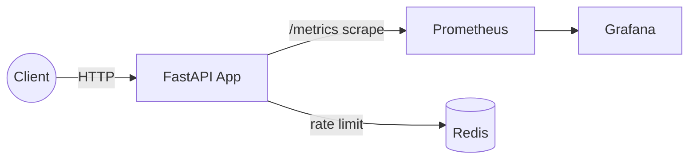

# AIAhura Tech — DevOps Technical Assessment: AI Inference Service

---
**AIAhura Tech** 
AI Infrastructure & Cloud GPU Solutions 
_DevOps Technical Assessment — Confidential_
---


# DevOps Technical Assessment — AI Inference Service

You are given a tiny AI inference API (FastAPI) that serves a toy sentiment model. Your job is to containerize it, make it reproducible, observable, and CI/CD‑ready.

## Quickstart
```bash
# 1) Copy .env.example to .env and adjust if needed
cp .env.example .env

# 2) Build and run everything
docker compose up --build

# Services
# API: http://localhost:8000
# Health: http://localhost:8000/healthz
# Metrics: http://localhost:8000/metrics
# Prometheus: http://localhost:9090
# Grafana: http://localhost:3000 (user: admin, pass: admin)
```

## What to deliver
- Working Dockerfile + docker-compose
- Health, metrics, rate limiting
- Prometheus scraping and Grafana reachable
- GitHub Actions CI (lint/tests/build + conditional push)
- Clear documentation of decisions and troubleshooting

## Configuration (.env)
```
PORT=8000
LOG_LEVEL=INFO
REDIS_URL=redis://redis:6379/0
RATE_LIMIT_PER_MIN=60
```

## Endpoints
- `GET /healthz` – health check
- `POST /predict` – sentiment label for `{"text": "..."}`
- `GET /metrics` – Prometheus metrics

## Makefile
Common commands:
```
make build # docker build
make run # docker compose up
make test # pytest
make lint # basic lint
make fmt # format code (ruff/black if installed)
make clean # remove build artifacts
```

## System Diagram (Mermaid)


## Notes
- Logs are JSON‑structured to stdout.
- Prometheus scrapes `app:8000/metrics` via docker network.
- Grafana provisioning adds Prometheus data source and an example dashboard.
- CI workflow is a skeleton; fill in registry creds to enable pushes.


---

## Candidate TODO Checklist
- [ ] Complete **Dockerfile** (multi-stage, non-root, pinned deps, entrypoint/cmd).
- [ ] Finish **docker-compose.yml**: define services, healthchecks, ports, resource limits.
- [ ] Implement **/metrics** in `app/app.py` using `prometheus_client`.
- [ ] Instrument requests in `app/metrics.py` (Counter + Histogram).
- [ ] Implement rate limiting in `app/rate_limit.py` (Redis-based, decorator form).
- [ ] Wire Redis into `/predict` via the rate limiter.
- [ ] Provision Prometheus to scrape the app (adjust `prometheus.yml` if needed).
- [ ] Provision Grafana: confirm Prometheus datasource; optional dashboard JSON.
- [ ] Finish **.github/workflows/ci.yml** to lint, test, build and (on main) push image.
- [ ] Update **Makefile** targets as needed.
- [ ] Document trade-offs and troubleshooting in README.

---
© 2025 AIAhura Tech. For interview assessment use.
